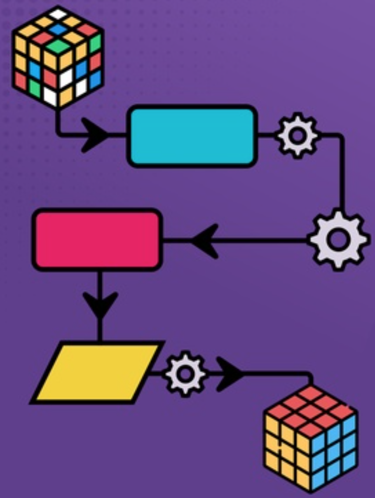
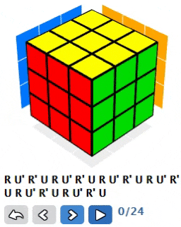
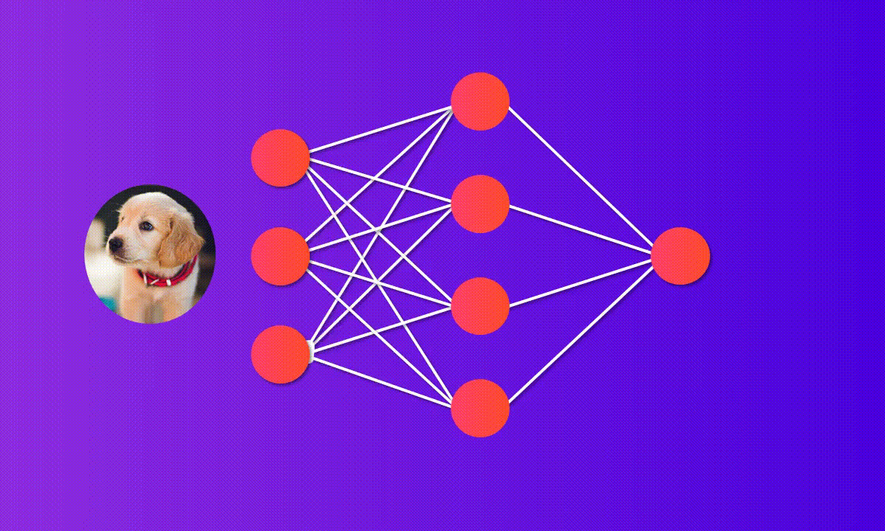
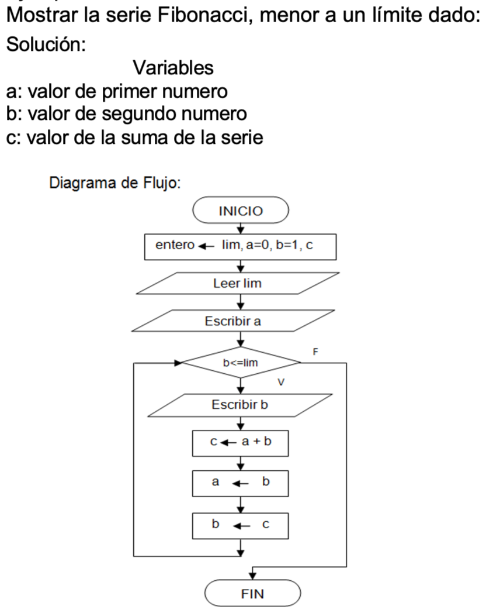
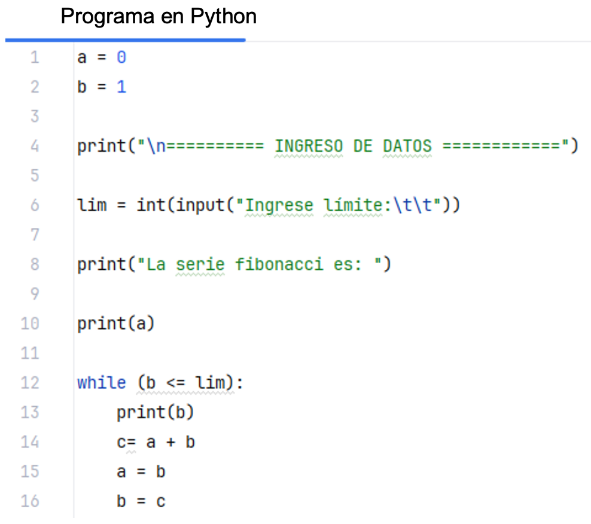
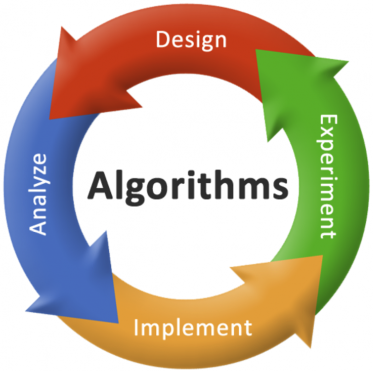
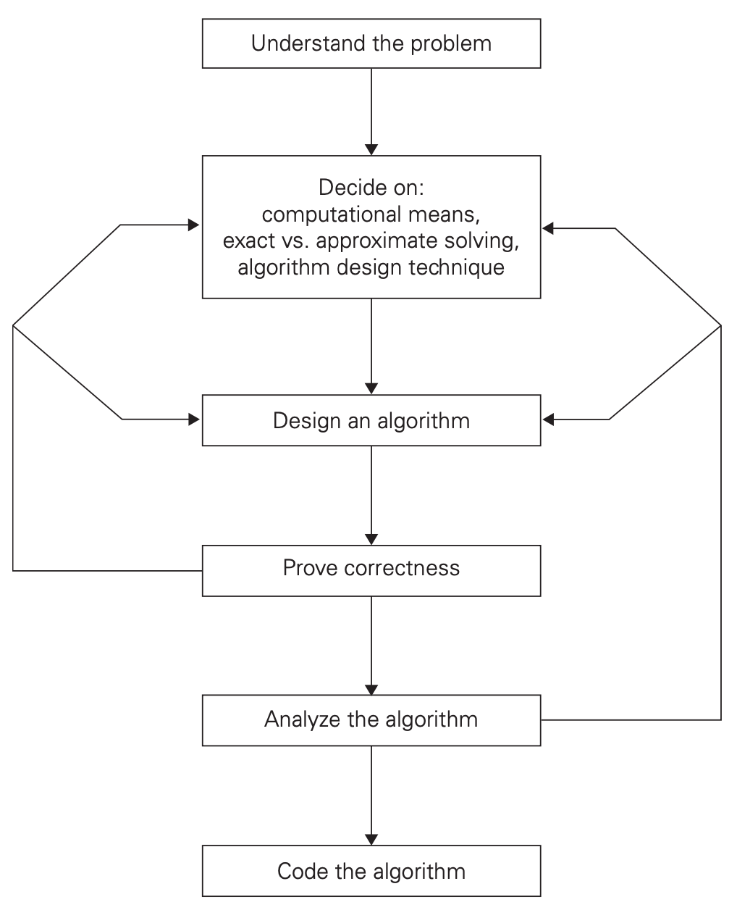

```{r setup, include=FALSE}
knitr::opts_chunk$set(cache = TRUE, echo = FALSE, warning = FALSE, message = FALSE)
```

## ¿Qué es un Algoritmo? {.center}

-   `Es un conjunto de instrucciones` **BIEN DEFINIDAS** `para resolver un problema`.

::::::: columns
:::: {.column width="50%"}
::: r-stack
{.fragment top="250" left="410" width="400" height="430"}
:::
::::

:::: {.column width="50%"}
::: r-stack
{.fragment top="250" left="410" width="400" height="430"}
:::
::::
:::::::

## Características {.center}

-   `Los algoritmos toman un conjunto de` **ENTRADAS** `, las` **PROCESAN** `y producen` **SALIDAS**.

::: r-stack
{.fragment top="250" left="310" width="700" height="400"}
:::

## Representaciones {.center}

::::::: columns
:::: {.column width="50%"}
-   `Diagrama de Flujo`

::: r-stack
{.fragment top="250" left="10" width="450" height="500"}
:::
::::

:::: {.column width="50%"}
-   `Programación`

::: r-stack
{.fragment top="150" left="400" width="450" height="500"}
:::
::::
:::::::

## Temas de Estudio {.center}

::: r-stack
{.fragment top="150" left="400" width="550" height="500"}
:::

##              Tipos y Técnicas de Algoritmos {.scrollable}

-   Algoritmos de búsqueda: Cómo encontrar información.

-   Algoritmos de ordenamineto: Cómo ordenar datos.

-   Algoritmos de clasificación: Organizar datos.

-   Algoritmos de optimización: Mejorar procesos.

-   Algoritmos de grafos: Encontrar el camino más corto, detectar ciclos, etc.

-   **Recursión**: La recursividad es una técnica poderosa en la que una función se llama a sí misma para resolver un problema dividiéndolo en instancias más pequeñas.

-   **Programación dinámica**: La programación dinámica implica dividir un problema complejo en subproblemas superpuestos más pequeños y resolverlos de forma independiente. A menudo se utiliza para optimizar el rendimiento en problemas con cálculos repetitivos.

-   **Algoritmo voraz** (*greedy*): es una estrategia que selecciona la mejor opción localmente en cada paso, sin tener en cuenta las consecuencias futuras, con el objetivo de encontrar una solución óptima global.

##          Diseño y Análisis de Algoritmos {.scrollable}

-   Diseñar un algoritmo implica dividir un problema en pasos más pequeños y manejables (**divide-and-conquer**). Requiere una planificación y consideración cuidadosas para garantizar la eficiencia y la precisión.

-   Aspectos para el diseño de algoritmos:

    1.  **Eficiencia**: Un algoritmo bien diseñado es eficiente, lo que significa que resuelve el problema de la manera más óptima. La eficiencia se mide por factores como el tiempo de ejecución del algoritmo y su uso de recursos computacionales. Es esencial lograr un equilibrio entre el rendimiento y el uso de recursos.
    2.  **Complejidad**: Los algoritmos tienen diferentes niveles de complejidad, que se pueden clasificar como complejidad temporal y complejidad espacial. La complejidad del tiempo se refiere a cómo el tiempo de ejecución del algoritmo aumenta con el tamaño de entrada. La complejidad del espacio se relaciona con la cantidad de memoria o almacenamiento que requiere el algoritmo.
    3.  **Análisis de algoritmos**: Analizar un algoritmo implica evaluar su eficiencia y complejidad. Este análisis ayuda a determinar las fortalezas, debilidades y áreas potenciales de mejora del algoritmo. Varias técnicas matemáticas, como la notación Big O, se utilizan para el análisis de algoritmos.
    4.  **Correctitud**: Un algoritmo se dice que es correcto, si para cada instancia (entrada), el algoritmo para y produce una salida correcta (esperada) y decimos que un algoritmo correcto resuelve un problema dado.

##          Diseño y Análisis de Algoritmos {.scrollable}

###                                       PROCESO

::: r-stack
{.fragment top="20" left="400" width="600" height="600"}
:::

## Conclusión {.center}

-   Los algoritmos son la base sobre la cual se construyen muchas de las tecnologías que utilizamos diariamente. Como futuros profesionales de Ciencias de la Computación, su capacidad para crear y optimizar algoritmos será fundamental en un mundo donde la IA jugará un papel cada vez más importante.


## PREGUNTAS... {.center}

{.r-stretch .fragment .absolute top="70" left="0" width="1000" height="600"}


