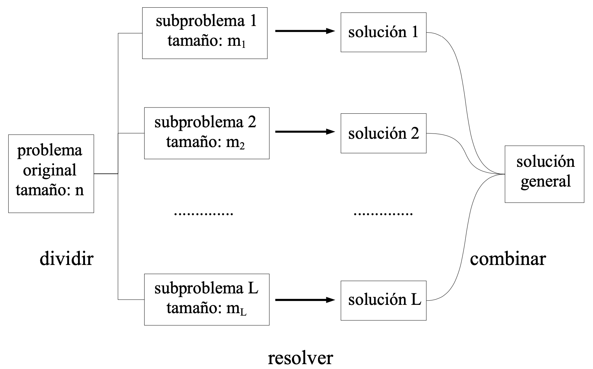
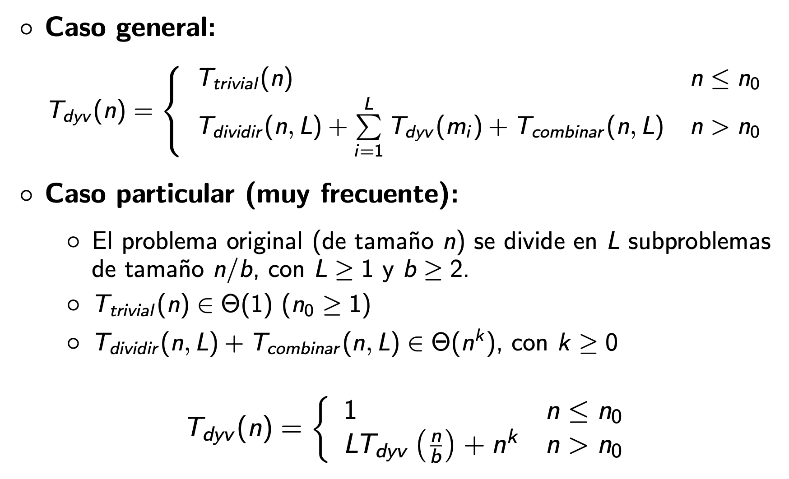
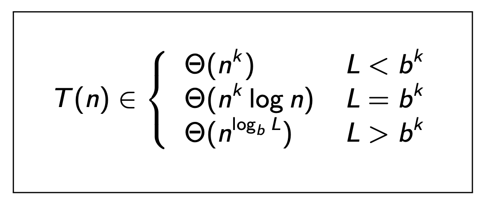

```{r setup, include=FALSE}
knitr::opts_chunk$set(cache = TRUE, echo = FALSE, warning = FALSE, message = FALSE)
```

## Propósito de la Sesión {.center}

- Determinar las estrategias de diseño algorítmico para el problema de ordenamiento:
    
    -  *QuickSort*
    -  *HeapSort*

## Contenidos a tratar {.center}

-   Aplicar el paradigma Divide y Vencerás.
-   Diseño y Análisis del algoritmo *QuickSort*.
-   Definir los Montículos y Estruturas *Max-Heap*
-   Algoritmo *HeapSort* y problemas de Selección Optima.


##                      Divide y Vencerás {.scrollable}

- Trata de resolver un problema de forma **recursiva**, a partir de la solución de subproblemas del mismo tipo pero de menor tamaño.

- El problema original se descompone en $L$ sub-problemas más pequeños:

    - Tamaño del problema original: $n$
    - Tamaño del sub-problema $i$: $m_i < n$
    - Típicamente $\sum_{i=1}^L m_i \leq n$
    
- Hipótesis:

    - Resolver un problema más pequeño tiene un coste menor
    - La solución de los casos muy pequeños es trivial y tiene coste fijo

- Los $L$ sub-problemas se resuelven por separado, aplicando el mismo algoritmo

- La solución al problema original se obtiene combinando las soluciones a los $L$ subproblemas

## Divide y Vencerás {.center}

{.r-stretch .fragment .absolute top="70" left="0" width="1000" height="600"}


##                        Divide y Vencerás  {.scrollable}

### Complejidad Temporal

{.r-stretch .fragment .absolute top="150" left="0" width="1000" height="600"}

{.r-stretch .fragment .absolute top="800" left="0" width="100" height="50"}

## Divide y Vencerás {.center}

- Ventajas:

    - simple, robusto y elegante
    - buena legibilidad
    - fácil depuración y mantenimiento del código
    
- Desventajas:

    - mayor coste espacial por el uso intensivo de la pila (stack) del sistema
    -  en ocasiones no se reduce, sino que incluso aumenta la complejidad temporal con respecto a soluciones iterativas

## Simuladores Visuales {.center}

- [https://sortvisualizer.com](https://sortvisualizer.com)

- [https://algorithm-visualizer.org](https://algorithm-visualizer.org)

## ¿Qué aprendimos hoy? {.center}

-  *QuickSort*
-  *HeapSort*


## Referencias Bibliografícas {.center}

-   *Cormen, T. H., Leiserson, C. E., Rivest, R. L., & Stein, C. (2022). Introduction to Algorithms (4th ed.). The MIT Press.*

    -   Capítulo 6 *HeapSort*
    -   Capítulo 7 *QuickSort*

## PREGUNTAS... {.center}

{.r-stretch .fragment .absolute top="70" left="0" width="1000" height="600"}
