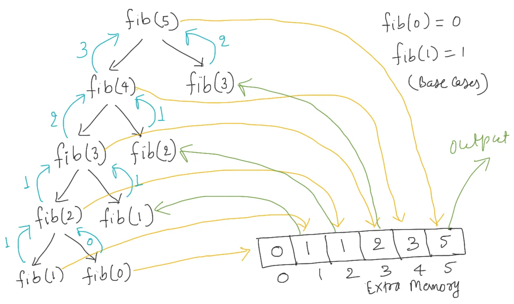
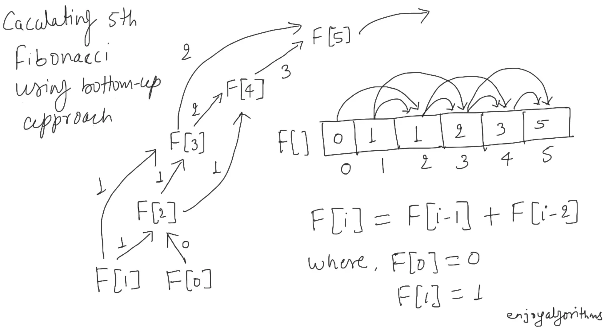
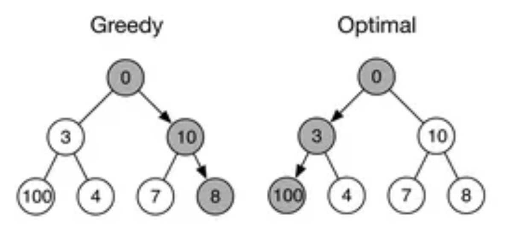
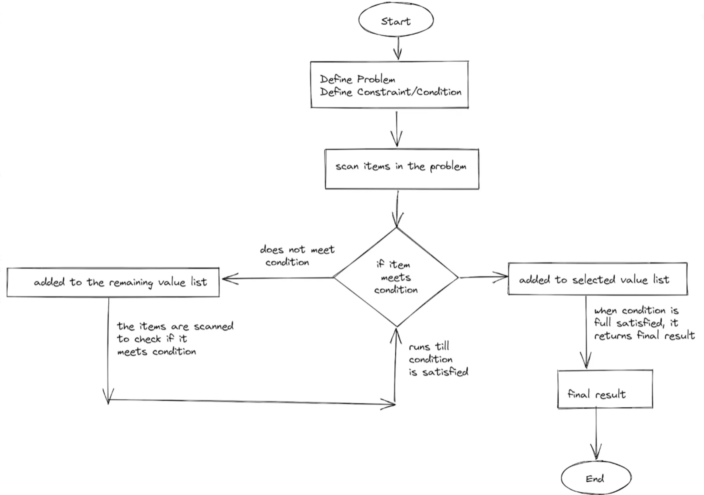

```{r setup, include=FALSE}
knitr::opts_chunk$set(cache = TRUE, echo = FALSE, warning = FALSE, message = FALSE)
```

## Propósito de la Sesión {.center}

-   Determinar las estrategias de diseño algorítmico avanzado para problemas computacionales (optimización, recorrido de grafos):

    -   *Programación Dinámica*
    -   *Algorítmos Voraces* (`Greedy`)
    -   *Representación de Grafos*

## Contenidos a tratar {.center}

-   Esquema, Diseño, Análisis y Ejemplos de:

    -   *Programación Dinámica*
    -   *Algorítmos Voraces*
    -   *Algorítmos de Grafos*.

##                Programación Dinámica {.scrollable}

-   El termino *Programación Dinámica* se refiere a un método tabular (no código)

-   [Richard Bellman 1957](https://gwern.net/doc/statistics/decision/1957-bellman-dynamicprogramming.pdf)

-   Los algoritmos diseñados mediante *Programación Dinámica*:

    -   Resuelven problemas de optimización (maximizan o minimizan) una función objetivo que mide la efectividad (costo) de una solución.
    -   Resuelven problemas combinando las soluciones de subproblemas.
    -   Los subproblemas estan superpuestos o solapados (`overlap`)
    -   Las soluciones de subsubproblemas se calculan una unica vez y se guardan en tablas o se memorizan.

##                Programación Dinámica {.scrollable}

-   Formas de Implementar (solucionar) *Programación Dinámica*:

    -   Esquema `top-down with memoization`: Se plantea de manera recursiva, modificada para guardar la solución de cada subproblema en una matriz o tabla hash. Este enfoque primero comprobará si ha resuelto previamente el subproblema. En caso afirmativo, devuelve el valor almacenado y guarda más cálculos. De lo contrario, el enfoque descendente calculará las soluciones de subproblemas de la manera habitual. Decimos que es la versión memorizada de una solución recursiva, es decir, recuerda qué resultados se han calculado anteriormente.

    -   Esquema: `bottom-up with tabulation`: Se plantea de manera iterativa. Depende de la idea natural "la solución de cualquier subproblema depende solo de la solución de subproblemas más pequeños". Así que el enfoque ordena los subproblemas por su tamaño de entrada y los resuelve iterativamente en orden de menor a mayor. En otras palabras, al resolver un subproblema en particular, el enfoque primero resolverá todos los subproblemas más pequeños de los que depende su solución y almacenará sus valores en memoria adicional.

##                Programación Dinámica {.scrollable}

-   DIFERENCIAS:

    1.  El enfoque de arriba hacia abajo asume que los subproblemas se resolverán usando el subproblema más pequeño solo una vez usando la recursión. A la inversa, de abajo hacia arriba compone la solución de los subproblemas de forma iterativa utilizando los subproblemas más pequeños.
    2.  La mayoría de las veces, el enfoque descendente es fácil de implementar porque solo agregamos una matriz o una tabla de búsqueda para almacenar los resultados durante la recursividad. Pero en un enfoque ascendente, necesitamos definir un orden iterativo para llenar la tabla y ocuparnos de varias condiciones límite.
    3.  El enfoque de arriba hacia abajo es más lento que el enfoque de abajo hacia arriba debido a la sobrecarga de las llamadas recursivas. En otras palabras, el enfoque ascendente a menudo tiene factores constantes mucho mejores, ya que no tiene sobrecarga para las llamadas recursivas.
    4.  El enfoque de arriba hacia abajo también tiene el espacio superior de la pila de llamadas de recursión. Si el árbol de recursión es muy profundo, es posible que nos quedemos sin espacio de pila, lo que bloqueará su programa.

##                Programación Dinámica {.scrollable}

{.r-stretch .fragment .absolute top="70" left="0" width="1000" height="600"}

##                Programación Dinámica {.scrollable}

{.r-stretch .fragment .absolute top="70" left="0" width="1000" height="600"}

##                Programación Dinámica {.scrollable}

-   Recurrente

```         
def fib_rec(n): 
    if n<2:
        return 1 
    else:
        return fib_rec(n-1)+fib_rec(n-2)
```

-   Top-Down

```         
fib_mem = {0:1, 1: 1}
def fib_rec_mem(n):
    if n in fib_mem:
        return fib_mem[n]
    fib_mem[n] = fib_rec_mem(n-1) + fib_rec_mem(n-2)
    return fib_mem[n]
```

-   Bottom-up

```         
def fib_ite(n): 
    t={0:1, 1:1}
    for i in range(2,n+1):
        t[i]=t[i-1]+t[i-2]
    return t[n]
```

##                Programación Dinámica {.scrollable}

-   Proceso:

    1.  Definir la función objetivo.
    2.  Definir recursivamente (`Ecuación de Bellman`) el valor óptimo de la función objetivo correspondiente a un problema en términos de los valores óptimos de dicha función para ciertos subproblemas.
    3.  Calcular los valores óptimos de la función objetivo de abajo arriba, empezando por problemas elementales y aplicando la definición recursiva del paso (2) hasta llegar al problema planteado originalmente.
    4.  Recuperar la solución óptima a partir de información almacenada durante el proceso de optimización.

##                Knapsack Problem 0-1 {.scrollable}

-   El problema de la mochila es un rompecabezas de optimización clásico. "`Dado un conjunto de elementos con pesos y valores específicos, determine la combinación que maximiza el valor total sin exceder la capacidad de peso.`"

-   La mochila 0-1 requiere elegir o rechazar cada artículo por completo, sin opción de tomar una fracción de un artículo.

-   Sea $M$ capacidad de peso de la mochila, sean $p_1,p_2,...,p_n$ los pesos de los $n$ elementos con beneficios $b_1,b_2,...,b_n$ respectivamente, entonces se debe encontrar qué combinación de elementos, representada mediante la tupla $x=(x_1,x_2,...,x_n)$,con $x_i\in \{0,1\}$, maximiza el beneficio:

-   $$f(x)=\sum_{i=1}^n b_ix_i$$

-   Sin sobrepasar el peso máximo $M$, esto es $$\sum_{i=1}^n p_ix_i\leq M$$

-   El problema de la mochila es **NP-Completo**, lo que significa que es computacionalmente intratable para resolver en instancias grandes. Los algoritmos más conocidos para el problema de la mochila tienen una complejidad de tiempo exponencial, lo que los hace poco prácticos para problemas a gran escala.

##                Knapsack Problem 0-1 {.scrollable}

### Implementación

```{r, include=FALSE}
library(reticulate)
#virtualenv_create("r-reticulate")
#virtualenv_install("r-reticulate", 
#                   packages = c("jupyter", "pyyaml", "pandas", "scikit-learn", #"matplotlib", "seaborn", "numpy"))
use_virtualenv("r-reticulate", required = TRUE)
py_config()
```

```{python}
#| echo: true
def knapsack(max_capacity, weights, values, n):
    # Initialize the 2D array with zeros
    K = [[0 for x in range(max_capacity + 1)] for x in range(n + 1)]
 
    # Build the 2D array in bottom-up manner
    for i in range(n + 1):
        for w in range(max_capacity + 1):
            if i == 0 or w == 0:
                K[i][w] = 0
            elif weights[i-1] <= w:
                K[i][w] = max(values[i-1] + K[i-1][w-weights[i-1]], K[i-1][w])
            else:
                K[i][w] = K[i-1][w]
 
    return K[n][max_capacity]
  
max_capacity = 10
values = [50, 40, 80, 10]
weights = [3, 4, 6, 2]
n = len(values)
print("Maximo beneficio obtenido:", knapsack(max_capacity, weights, values, n))
```

```{python}
#| echo: true
def knapsack_with_items(max_capacity, weights, values, n):
    # Crear tabla DP
    K = [[0 for _ in range(max_capacity + 1)] for _ in range(n + 1)]

    # Llenado bottom-up
    for i in range(n + 1):
        for w in range(max_capacity + 1):
            if i == 0 or w == 0:
                K[i][w] = 0
            elif weights[i-1] <= w:
                K[i][w] = max(
                    values[i-1] + K[i-1][w - weights[i-1]],
                    K[i-1][w]
                )
            else:
                K[i][w] = K[i-1][w]

    # 🔍 Reconstrucción de la solución
    w = max_capacity
    selected_items = []

    for i in range(n, 0, -1):
        if K[i][w] != K[i-1][w]:
            # Este objeto fue incluido
            selected_items.append(i-1)  # índice del objeto
            w -= weights[i-1]

    # Invertir para orden original
    selected_items.reverse()

    # Construir detalle (peso, valor)
    result = []
    for i in selected_items:
        result.append({
            "item": i,
            "weight": weights[i],
            "value": values[i]
        })

    return K[n][max_capacity], result

values = [50, 40, 80, 10]
weights = [3, 4, 6, 2]
W = 10
n = len(weights)
max_value, items = knapsack_with_items(W, weights, values, n)
print("Items seleccionados:", items)
```

```{python}
#| echo: true
def knapsack_with_items(max_capacity, weights, values, n):
    # Crear tabla DP
    K = [[0 for _ in range(max_capacity + 1)] for _ in range(n + 1)]

    # Llenado bottom-up
    for i in range(n + 1):
        for w in range(max_capacity + 1):
            if i == 0 or w == 0:
                K[i][w] = 0
            elif weights[i-1] <= w:
                K[i][w] = max(
                    values[i-1] + K[i-1][w - weights[i-1]],
                    K[i-1][w]
                )
            else:
                K[i][w] = K[i-1][w]

    # 🔍 Reconstrucción de la solución
    w = max_capacity
    selected_items = []

    for i in range(n, 0, -1):
        if K[i][w] != K[i-1][w]:
            # Este objeto fue incluido
            selected_items.append(i-1)  # índice del objeto
            w -= weights[i-1]

    # Invertir para orden original
    selected_items.reverse()

    # Construir detalle (peso, valor)
    result = []
    for i in selected_items:
        result.append({
            "item": i,
            "weight": weights[i],
            "value": values[i]
        })

    return K[n][max_capacity], result

W = 50

weights = [
    2, 5, 10, 5, 7,
    3, 8, 6, 9, 4,
    11, 13, 2, 1, 12,
    7, 6, 5, 4, 3
]

values = [
    20, 30, 50, 10, 40,
    25, 35, 30, 45, 15,
    60, 70, 10, 5, 65,
    35, 30, 25, 20, 15
]
n = len(weights)
max_value, items = knapsack_with_items(W, weights, values, n)
print("Valor máximo:", max_value)
print("Items seleccionados:", items)
```

##                LCS {.scrollable}

-   La subsecuencia común más larga es la `secuencia más larga que aparece en el mismo orden relativo en dos cadenas`, pero no necesariamente de forma contigua.

-   Aplicación biológica: comparación de secuancias de ADN para determinar "similaridad":

    -   $S_1=$ `ACCGGTCGAGTGCGCGGAAGCCGGCCGAA`
    -   $S_2=$ `GTCGTTCGGAATGCCGTTGCTCTGTAAA`

-   **Similaridad**: las bases aparecen en el mismo orden, pero no necesariamente de forma consecutiva (busqueda manual).

    -   $S_c=$ `GTCGTCGGAAGCCGGCCGAA`
    -   $S_1=$ ACCG `GTC` GA `GT` GCG `CGGAAGCCGGCCGAA`
    -   $S_2=$ `GTCGT` T `CGGAA` T `GCCG` TT `GC` T `C` T `G` T `AA` A

-   Ver Libro: "Cap 14.4"

-   Implementación: PD-Tabulación, time-complexity $O(m*n)$ $m,n$ longitudes de las dos cadenas.

```{python}
#| echo: true

def lcs(text1, text2):
    m, n = len(text1), len(text2)
    
    # Crear tabla DP
    dp = [[0] * (n + 1) for _ in range(m + 1)]

    # Llenar la tabla
    for i in range(1, m + 1):
        for j in range(1, n + 1):
            if text1[i-1] == text2[j-1]:
                dp[i][j] = dp[i-1][j-1] + 1
            else:
                dp[i][j] = max(dp[i-1][j], dp[i][j-1])

    # Reconstruir la LCS
    i, j = m, n
    lcs_str = []

    while i > 0 and j > 0:
        if text1[i-1] == text2[j-1]:
            lcs_str.append(text1[i-1])
            i -= 1
            j -= 1
        elif dp[i-1][j] > dp[i][j-1]:
            i -= 1
        else:
            j -= 1

    lcs_str.reverse()  # porque lo construimos al revés

    return dp[m][n], "".join(lcs_str)

# Ejemplo
length, subseq = lcs("ACCGGTCGAGTGCGCGGAAGCCGGCCGAA", "GTCGTTCGGAATGCCGTTGCTCTGTAAA")
print("Longitud:", length)
print("LCS:", subseq)
```

##                Programación Dinámica {.scrollable}

-   Ventajas:

    -   Reduce la complejidad del tiempo: Evita recalcular los resultados al almacenarlos (memoización).
    -   Solución eficiente: Resuelve problemas más rápido que usando un enfoque de fuerza bruta.
    -   Optimiza las soluciones recursivas: Convierte los problemas de tiempo exponencial en tiempo polinómico.

-   Desventajas:

    -   Alto uso de memoria debido al almacenamiento de resultados intermedios.
    -   No es adecuado para problemas sin subproblemas superpuestos.

##                Algorítmos Voraces {.scrollable}

-   Los algoritmos *greedy* funcionan haciendo la `elección óptima localmente en cada paso con la esperanza de encontrar el óptimo global`. **En cada paso, elige la opción que se vea mejor en este momento.**

-   Los algoritmos *greedy* no siempre producen la solución optima. Se usan para resolver problemas de optimización.

-   Antes de aplicar un algoritmo *greedy* a un problema, necesitas hacer dos preguntas:

    -   ¿Necesitas la mejor opción en este momento del problema?
    -   ¿Necesita una solución óptima (ya sea de valor mínimo o máximo)?

-   Solución: *greedy*

##                Algorítmos Voraces {.scrollable}

-   Ejemplo de un algoritmo *greedy* que falla en maximizar la suma de los nodos a lo largo de un camino de la raiz a la hoja.

{.r-stretch .fragment .absolute top="250" left="0" width="50" height="30"}

##                Algorítmos Voraces {.scrollable}

-   **PROCEDIMIENTO**

    -   Supongamos que tiene un problema con un conjunto de números y necesita encontrar el valor mínimo.
    -   Empiezas definiendo la restricción, que en este caso es encontrar el valor mínimo.
    -   Luego, cada número será escaneado y marcado en cada restricción que sirve como condición para cumplir. Si la condición es verdadera, los números se seleccionan y se devuelven como la solución final.

##                Algorítmos Voraces {.scrollable}

{.r-stretch .fragment .absolute top="70" left="0" width="1000" height="600"}

##                Algorítmos Voraces {.scrollable}

### Selección de Actividad

-   Ver libro (Cap 15.1)

-   Este problema contiene un conjunto de actividades o tareas que deben completarse. Cada uno tiene una hora de inicio y finalización. El algoritmo encuentra el número máximo de actividades que se pueden realizar en un tiempo determinado sin que se superpongan.

    -   Tenemos una lista de actividades. Cada uno tiene una hora de inicio y una hora de finalización.
    -   Primero, ordenamos las actividades y la hora de inicio en orden ascendente utilizando la hora de finalización de cada una.
    -   Luego empezamos eligiendo la primera actividad. Creamos una nueva lista para almacenar la actividad seleccionada.
    -   Para elegir la siguiente actividad, comparamos la hora de finalización de la última actividad con la hora de inicio de la siguiente actividad. Si la hora de inicio de la siguiente actividad es mayor que la hora de finalización de la última actividad, se puede seleccionar. Si no, nos saltamos esto y revisamos el siguiente.
    -   Este proceso se repite hasta que se verifiquen todas las actividades. La solución final es una lista que contiene las actividades que se pueden realizar.

```{python}
#| echo: true

def activity_selection(activities):
    # Ordenar por tiempo de finalización
    activities.sort(key=lambda x: x[2])
    
    selected = []
    
    # Seleccionar la primera actividad
    selected.append(activities[0])
    last_end = activities[0][2]
    
    # Iterar sobre las demás
    for i in range(1, len(activities)):
        if activities[i][1] >= last_end:
            selected.append(activities[i])
            last_end = activities[i][2]
    
    return selected

# Ejemplo

activities = [
    ("Estudiar", 1, 3),
    ("Jugar fútbol", 2, 5),
    ("Bailar", 4, 6),
    ("Leer", 6, 7),
    ("Gimnasio", 5, 9),
    ("Ver TV", 8, 10)
]

result = activity_selection(activities)

print("Actividades seleccionadas:")
for act in result:
    print(f"{act[0]}: inicio={act[1]}, fin={act[2]}")
```

## Algorítmos Voraces {.center}

-   Ventajas:

    -   Los algoritmos codiciosos son bastante fáciles de implementar y fáciles de entender.
    -   También son muy eficientes y tienen un tiempo de menor complejidad
    -   Son útiles para resolver problemas de optimización, devolviendo un valor máximo o mínimo.

-   Desventajas:

    -   No ofrecen las mejores soluciones en todo momento.
    -   No comprueban la exactitud del resultado producido.

##                Representación de Grafos {.scrollable}

## Simuladores Visuales {.center}

## ¿Qué aprendimos hoy? {.center}

-   *Programación Dinámica*
-   *Algorítmos Varaces*
-   *Algorítmos de Grafos*.

## Referencias Bibliografícas {.center}

-   *Cormen, T. H., Leiserson, C. E., Rivest, R. L., & Stein, C. (2022). Introduction to Algorithms (4th ed.). The MIT Press.*

    -   Capítulo 14 *Dynamic Programming*
    -   Capítulo 15 *Greedy Algorithms*
    -   Capítulos 20, 21, 22, 23 *Graph Algorithms*

## PREGUNTAS... {.center}

{.r-stretch .fragment .absolute top="70" left="0" width="1000" height="600"}
