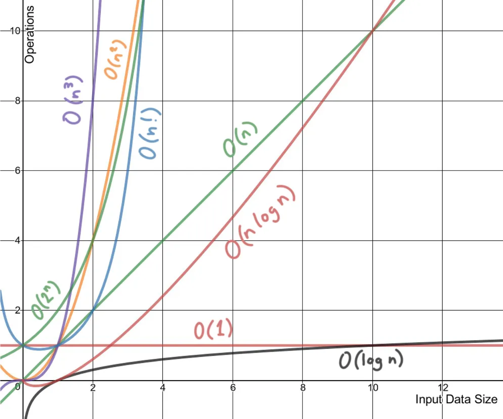

```{r setup, include=FALSE}
knitr::opts_chunk$set(cache = TRUE, echo = FALSE, warning = FALSE, message = FALSE)
```

##                Propósito de la Sesión {.scrollable}

-   Diseñar soluciones computacionales sencillas o aproximadas para problemas cuya resolución exacta no es eficiente, mediante el análisis de su complejidad algorítmica.

-   Para problemas `difíciles`, muchas veces no se puede encontrar una solución óptima en tiempo razonable (`polinómico`). Entonces, lo que se hace en la práctica es:

    -   Diseñar soluciones aproximadas o heurísticas que sean "rápidas" o sean soluciones "suficientemente buenas".

    -   Ejemplo: Traveling salesman problem (Problema del Viajante), dado un conjunto de ciudades, encontrar la ruta más corta que las visite todas una vez. Solución exacta: complejidad factorial ($O(n!)$). Solución aproximada: algoritmo *greedy* (siempre ir a la ciudad más cercana no visitada.)

## Contenidos a tratar {.center}

-   *Complejidad Computacional (Algorítmica)*
-   *Problemas P y NP*
-   *Problemas NP-Completos y Reducciones*
-   *Algoritmos de Aproximación*

## Complejidad Computacional {.center}

::: r-stack
{.r-stretch .fragment .absolute top="100" left="200" width="700" height="600"}
:::

##                Complejidad Computacional {.scrollable}

-   La complejidad algorítmica mide los recursos (*Tiempo* y *Espacio*) requeridos para ejecutar un algoritmo, en función del tamaño de la entrada (*n*).

-   **TIME**: La complejidad temporal $T(n)$ de un algoritmo es su tiempo de ejecución (el número de operaciones requeridas)

-   **SPACE**: La complejidad espacial de un algoritmo es la cantidad de memoria necesaria para su ejecución.

-   **BIG-O**: Es la notación matemática que clasifica los algoritmos en función de sus requisitos de tiempo de ejecución o espacio a medida que crece el tamaño de la entrada $n$

-   **Ejemplos**

    -   Tiempo Constante: $O(1)$
    -   Tiempo Logaritmico: $O(\log n)$
    -   Tiempo Polinomial: $O(n^k)$
    -   Tiempo Exponencial : $O(2^n)$

##                Problemas P y NP {.scrollable}

-   **Clases de Complejidad**: En general se tienen las clases de Complejidad de los algoritmos.

    -   Clase **P**: Consiste de los problemas que se resuelven `eficientemente` en tiempo polinomial $O(n^k)$ para una constante $k$.
    -   Clase **NP** (No-deterministic Polinomial Time): Consiste de los problemas que se pueden `verificar` en tiempo polinomial (Dado una posible solución de los problemas en la clase NP, se puede verificar si dicha solución es correcta en tiempo polinomial). Los problemas en esta clase se dicen que son intratables o dificiles `hard`, ya que su tiempo de complejidad para solucionarlos son `superpolinomiales` (exponencial, factorial, etc.)
    -   Clase **NP-Complete** Los problemas **NP-completos** son los problemas más difíciles en el conjunto **NP** (tiempo polinómico no determinista), que representan tareas para las que no se conoce ningún algoritmo de solución eficiente y rápida, pero cualquier solución propuesta se puede verificar en tiempo polinómico.
    -   Clase **NP-hard** (Non-deterministic Polynomial-time hard) se refiere a una clase de problemas computacionales que son al menos tan difíciles como los problemas más difíciles en **NP**. Un problema es **NP-duro** si todos los problemas en **NP** se pueden `reducir` a él en tiempo polinómico. Estos problemas son generalmente intratables, lo que significa que ningún algoritmo eficiente conocido los resuelve exactamente, lo que los hace difícil de resolver para grandes entradas.

##                Problemas P y NP {.scrollable}

::: r-stack
{.r-stretch .fragment .absolute top="100" left="250" width="600" height="600"}
:::

##                Problemas P y NP {.scrollable}

-   $P\subseteq NP$: Todo problema que pertenece a la clase **P**, tambien pertenece a la clase **NP**.

-   $P \neq NP$: El problema **P vs NP** fue planteado formalmente por Stephen Cook en 1971, en su artículo clásico: [The Complexity of Theorem-Proving Procedures](https://www.cs.toronto.edu/~sacook/homepage/1971.pdf).

    -   En ese trabajo, Cook introdujo la noción de **NP-completitud** y formuló esencialmente la gran pregunta: `¿Todo problema cuya solución puede verificarse rápidamente también puede resolverse rápidamente?` ($NP\subseteq P$).

    -   Además mostró que el problema de satisfacibilidad booleana **SAT** era el primero de ellos. Paralelamente Levin desarrollo ideas similares.

##                Problemas NP-Completos {.scrollable}

-   **Teorema Cook-Levin** plantea que SAT es NP-completo, que es el punto de arranque de todo el problema.

-   SAT: `¿Existe alguna asignación de valores (verdadero/falso) a variables booleanas que haga verdadera una fórmula lógica?`

    -   Supón la fórmula: $(x \vee y) \wedge (\lnot x \vee z)$ -La pregunta es: ¿puedes elegir valores para $x,y,z$ que hagan toda la expresión verdadera?
    -   Solución: $x=V, y=F, z=V$, la formula se vuelve verdadera, entonces es satisfacible.
    -   Pero: $(x)\wedge(\lnot x)$ no importa el valor de $x$ es insatisfacible.

-   SAT suele expresarse en Forma Normal Conjuntiva (CNF): Cada cláusula es una disyunción (OR) de literales (proposiciones atómicas). $(clausula_1)\wedge (clausula_2)\wedge...$

    -   3SAT es el problema SAT pero cada cláusula tiene exactamente 3 literales. $(x\vee\lnot y \vee z) \wedge (\lnot x \vee y \vee w)$
    -   SAT general cláusulas de cualquier tamaño
    -   2SAT máximo 2 literales (fácil, está en $P$)
    -   3SAT exactamente 3 literales (difícil, $NP-completo$)

##                         Reducciones {.scrollable}

-   `Reducción`: Una reducción es transformar un problema en otro de forma que: si sabes resolver el segundo, automáticamente resuelves el primero

    -   $A\leq_p B$: Decimos que un problema $A$ se reduce a otro $B$ si: Puedes transformar cualquier instancia de $A$ en una instancia de $B$, la transformación es rápida (tiempo polinómico)
    -   Ejemplo: Problema A: “resolver sudoku”. Problema B: “resolver SAT”, Si conviertes cualquier sudoku en una fórmula SAT, Sudoku $\leq_p$ SAT, entonces: Si tienes un algoritmo rápido para SAT puedes resolver sudoku rápido.

-   Para demostrar que un problema $X$ es NP-completo: Tomas un problema ya conocido (como SAT), Lo reduces a $X$, Concluyes: $X$ es tan difícil como SAT

    -   $SAT\leq_p3SAT$ Puedes convertir cualquier SAT en 3SAT, Entonces 3SAT es igual de difícil.

##             Algoritmos Aproximados {.scrollable}

-   Algoritmos Aproximados para problemas *NP-Completos*

-   Muchos problemas NP-completos no pueden resolverse eficientemente de manera exacta para entradas grandes.

-   Los algoritmos aproximados buscan:

    -   Encontrar soluciones rápidas.
    -   Garantizar qué tan cerca están del óptimo.
    -   Sacrificar exactitud por eficiencia.

-   Se trabaja especialmente con problemas de optimización:

    -   Minimización: costo lo más pequeño posible.
    -   Maximización: beneficio lo más grande posible.

-   Razón de Aproximación en Algoritmos Aproximados.

    -   Es una medida que indica qué tan buena es la solución producida por un algoritmo aproximado comparada con la solución óptima.
    -   Para minimización se define: $$\rho(n)=\frac{C}{C^*}$$
    -   $C$: es el costo obtenido por el algoritmo aproximado.
    -   $C^*$: es el costo óptimo verdadero.
    -   Como el óptimo es el menor posible $C\geq C^*$, entonces $$\rho(n)\geq 1$$

-   Regla Heuristica:

| Razón | Significado                  |
|-------|------------------------------|
| 1     | solución perfecta            |
| 1.1   | máximo 10% peor              |
| 2     | máximo el doble              |
| 5     | puede ser hasta 5 veces peor |

-   Mientras más cerca de 1 mejor el algoritmo aproximado.

-   Para problemas de maximización: $$\rho(n)=\frac{C^*}{C}$$

-   **PTAS** y **FPTAS** en Algoritmos Aproximados

    -   los conceptos PTAS (polinomial-time approximation scheme) y FPTAS (full polinomial-time approximation scheme) describen familias de algoritmos aproximados que pueden producir soluciones extremadamente cercanas al óptimo.

    -   Un **PTAS** es una familia de algoritmos que, para cualquier: $\epsilon > 0$ encuentra una solución con razón de aproximación: $1+\epsilon$ en tiempo polinómico respecto al tamaño de entrada.

## Simuladores Visuales {.center}

-   [Traveling Salesman Problem 1](https://algorithms.discrete.ma.tum.de/graph-games/tsp-game/index_en.html)

-   [Traveling Salesman Problem 2](https://www.math.uwaterloo.ca/tsp/)

-   [Visualizing Algorithms USFCA](https://www.cs.usfca.edu/~galles/visualization/)

-   [Visualgo](https://visualgo.net/en)

## ¿Qué aprendimos hoy? {.center}

-   *Complejidad Computacional*
-   *Problemas P y NP*
-   *Problemas NP-Completos y Reducciones*
-   *Algoritmos de Aproximación*

## Referencias Bibliografícas {.center}

-   *Cormen, T. H., Leiserson, C. E., Rivest, R. L., & Stein, C. (2022). Introduction to Algorithms (4th ed.). The MIT Press.*

    -   Capítulo 34 *NP-Completeness*
    -   Capítulo 35 *Approximation Algorithms*

## PREGUNTAS... {.center}

{.r-stretch .fragment .absolute top="70" left="0" width="1000" height="600"}
