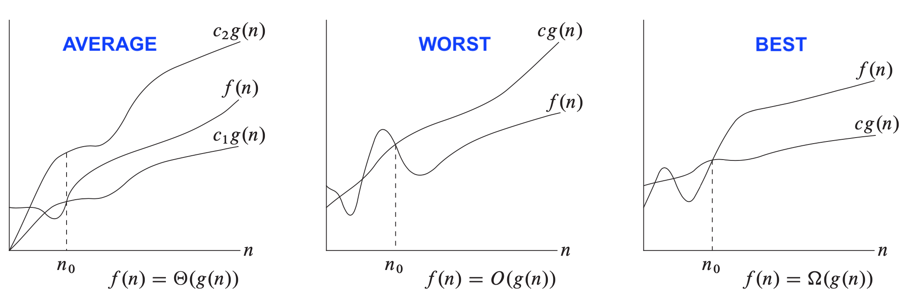
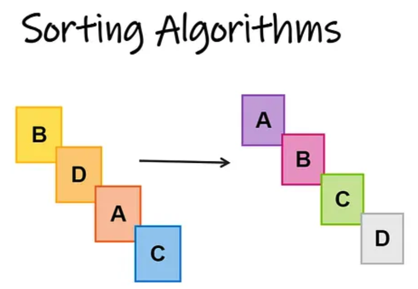
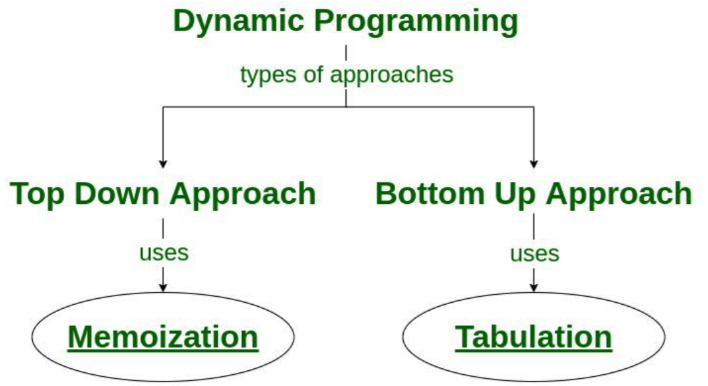
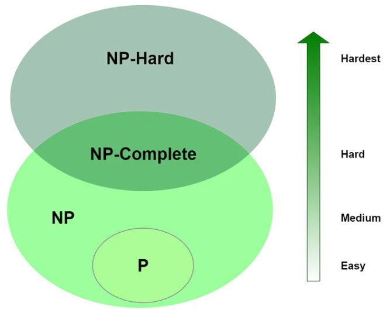
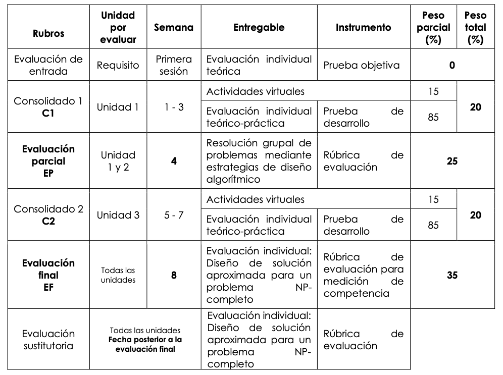
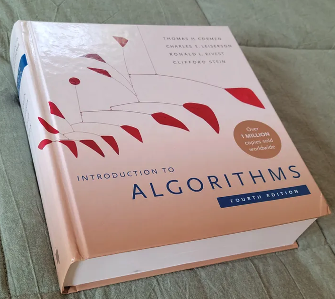

#              CONTENIDO {.center}

## UNIDAD 1 {.center}

-   [Análisis y Técnicas Básicas]{style="color:green;"}

    1.  Eficiencia de un algoritmo
    2.  Notación asintótica
    3.  Fundamentos matemáticos
    4.  Análisis de algoritmos recursivos

::: r-stack
{.r-stretch .fragment .absolute top="180" left="600" width="600" height="200"}
:::

## UNIDAD 2 {.center}

-   [Estrategias Algorítmicas I]{style="color:green;"}

    1.  Diseño y análisis del algoritmo QuickSort
    2.  Aplicación del paradigma Divide y Vencerás
    3.  Montículos (Heap) y estructura Max-Heap
    4.  Algoritmo HeapSort y problemas de selección óptima

::: r-stack
{.r-stretch .fragment .absolute top="50" left="800" width="400" height="300"}
:::

## UNIDAD 3 {.center}

-   [Estrategias Algorítmicas II]{style="color:green;"}

    1.  Programación dinámica
    2.  Aplicaciones avanzadas de PD
    3.  Algoritmos voraces (*Greedy*)
    4.  Representación y recorrido de grafos

::: r-stack
{.r-stretch .fragment .absolute top="50" left="650" width="450" height="300"}
:::

## UNIDAD 4 {.center}

-   [Complejidad Computacional]{style="color:green;"}

    1.  Complejidad algorítmica
    2.  Problemas P y NP
    3.  NP-completitud y reducciones
    4.  Algoritmos de aproximación

::: r-stack
{.r-stretch .fragment .absolute top="50" left="600" width="450" height="400"}
:::

## EVALUACION {.center}

::: r-stack
{.r-stretch .fragment .absolute top="70" left="200" width="750" height="600"}
:::

## BIBLIOGRAFIA {.center}

::: r-stack
{.r-stretch .fragment .absolute top="70" left="200" width="700" height="600"}
:::

## SOFTWARE {.center}

::: r-stack
{.r-stretch .fragment .absolute top="70" left="200" width="600" height="400"}
:::

## PREGUNTAS... {.center}

::: r-stack
{.r-stretch .fragment .absolute top="70" left="0" width="1000" height="600"}
:::
